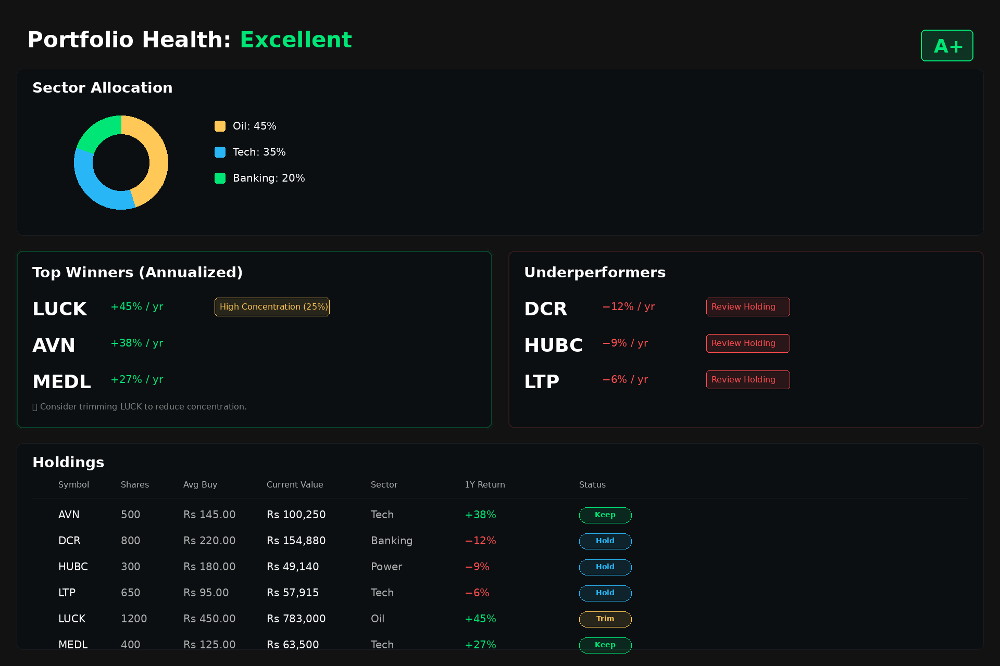

# Portfolio Health & Rebalancing Screen

This directory contains UI mockup assets for the Portfolio Health & Rebalancing feature - a dark-mode, Robinhood-style dashboard focused on long-term portfolio analysis and rebalancing recommendations.

## Preview

## Design Overview

The screen provides a comprehensive view of portfolio health, highlighting top performers, identifying underperformers, and offering actionable rebalancing suggestions based on concentration risk and performance metrics.

### Key Sections

1. **Portfolio Health Header** - Overall health score with visual grade indicator
2. **Sector Allocation** - Donut chart visualization showing portfolio diversification
3. **Top Winners** - High-performing holdings with annualized returns and concentration warnings
4. **Underperformers** - Low-performing holdings flagged for review
5. **Holdings Table** - Complete portfolio view with actionable status indicators

## Design Specifications

### Color Tokens

| Token | Hex Code | Usage |
|-------|----------|-------|
| Background | `#121212` | Main app background |
| Card Surface | `#0B0F12` | Primary card background |
| Card Alt | `#101418` | Alternate card background |
| Border | `rgba(255,255,255,0.06)` | Subtle card borders |
| Text Primary | `#FFFFFF` | Main headings and labels |
| Text Secondary | `#B0B0B0` | Supporting text |
| Text Muted | `#808080` | Hints and tertiary text |
| Emerald (Positive) | `#00E676` | Gains, "Keep" status, health indicators |
| Amber (Warning) | `#FFC857` | Concentration warnings, "Trim" status |
| Red (Negative) | `#FF4D4F` | Losses, "Review" badges |
| Blue (Info) | `#29B6F6` | "Hold" status, informational elements |
| Teal (Accent) | `#4FC3F7` | Secondary accent |

### Typography

- **Font Family**: Inter (or DejaVu Sans fallback)
- **Headers**: 28-42px, Semibold/Bold
- **Body Text**: 20px, Regular
- **Small Text**: 16px, Regular
- **Badges**: 14px, Bold
- **Large Numbers**: 36px, Bold

### Layout & Spacing

- **Canvas**: 1920 × 1280 pixels
- **Page Padding**: 32px
- **Card Border Radius**: 12px
- **Badge Border Radius**: 6-14px (depending on size)
- **Card Shadows**: `0 8px 24px rgba(0,0,0,0.45)`
- **Card Spacing**: 30px vertical gap between sections

## Component Details

### Sector Allocation Donut Chart
- **Segments**: Oil (45%, Amber), Tech (35%, Blue), Banking (20%, Emerald)
- **Inner Radius**: 60% of outer radius for donut effect
- **Legend**: Color-coded boxes with percentage labels

### Top Winners Card
- **Visual Treatment**: Emerald border with subtle outer glow
- **Entries**:
  - LUCK: +45%/yr with "High Concentration (25%)" amber badge
  - AVN: +38%/yr
  - MEDL: +27%/yr
- **Tip**: Suggests trimming LUCK to reduce concentration

### Underperformers Card
- **Visual Treatment**: Red border accent, muted background
- **Entries**:
  - DCR: −12%/yr with "Review Holding" red badge
  - HUBC: −9%/yr with "Review Holding" red badge
  - LTP: −6%/yr with "Review Holding" red badge

### Holdings Table
- **Columns**: Symbol | Shares | Avg Buy | Current Value | Sector | 1Y Return | Status
- **Status Pills**:
  - **Keep** (Emerald): Solid performers to maintain
  - **Trim** (Amber): High concentration, consider reducing
  - **Hold** (Blue): Monitor without immediate action
- **Sample Holdings**: AVN, DCR, HUBC, LTP, LUCK (marked for trimming), MEDL

## Usage Notes

- This is a **static design mockup** for communication and planning purposes
- No interactive functionality or live data integration
- Use as reference for implementing actual portfolio health features
- All ticker symbols and values are sample data for demonstration

## File Information

- **Filename**: `portfolio-health-rebalance-1920x1280.png`
- **Format**: PNG
- **Dimensions**: 1920 × 1280 pixels
- **Size**: ~119 KB
- **Created**: November 2025

---

*Design adheres to Robinhood-style aesthetic with focus on clarity, actionable insights, and clean dark-mode presentation.*
